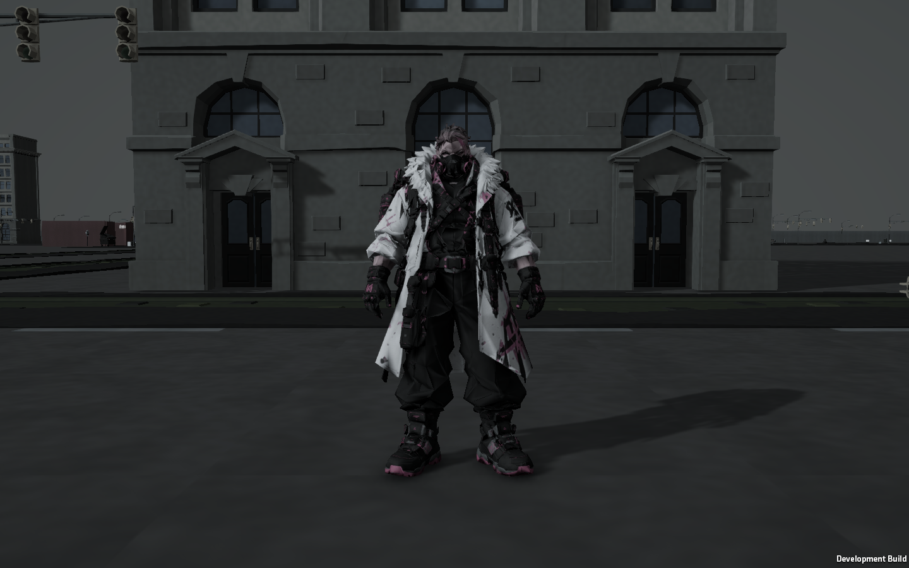
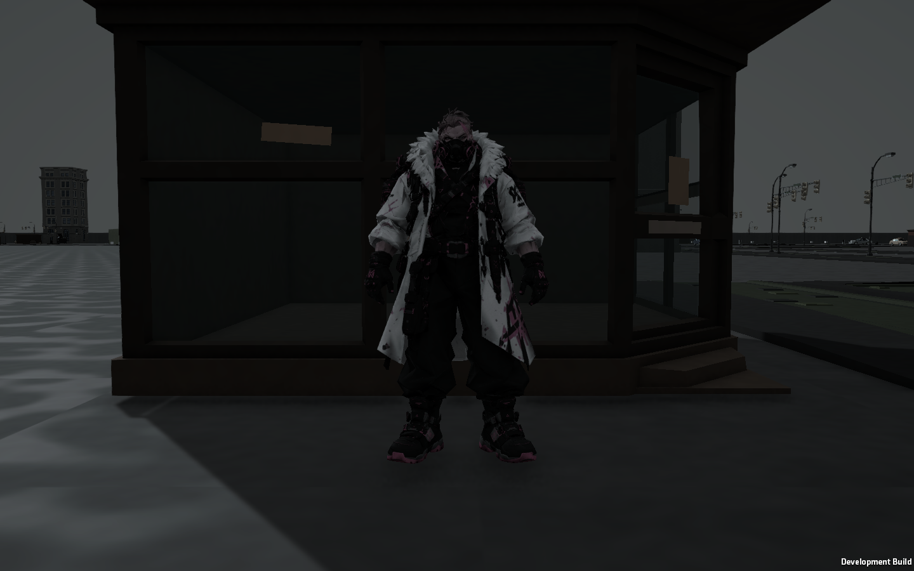
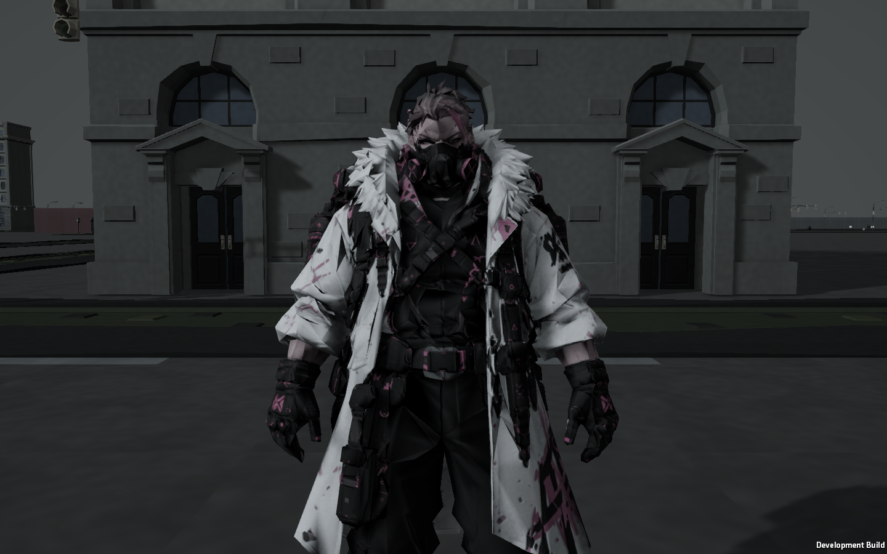

# HumanThings Character Visual Pass

## 1. 실제 에셋 구조

- 원본 모델: `Assets/Character/Meshy_AI_Neon_Vanguard_All_Animations.glb`
- 원본 플레이어 프리팹: `Assets/Resources/PlayerCharacter.prefab`
- 계층: PlayerCharacter / Facing / Neon Vanguard / target_character / output_unwrapped.
- SkinnedMeshRenderer 1개, 메시 1개, 서브메시 1개, 머터리얼 슬롯 1개, 정점 19,590개, 본 27개.
- 피부, 머리, 코트, 장비는 별도 머터리얼이 아니라 하나의 UV 아틀라스에 함께 들어 있다.
- 원본 머터리얼은 GLB 내부의 `BakedMaterial`, 셰이더는 `Shader Graphs/glTF-pbrMetallicRoughness`.
- URP, Linear color space. Albedo 2048x2048, tangent normal 2048x2048, metallic/roughness 4096x4096.
- glTF 패킹: G=roughness, B=metallic. 원본 metallicFactor=1, roughnessFactor=1, normal scale=1.
- 원본 emission=0, emissive map 없음, AO map 없음. 별도 rim, stylized Fresnel, SSS, clear coat, MatCap, outline 없음. 일반 PBR Fresnel은 존재한다.

## 2. 원본 보존

GLB, 원본 프리팹, 원본 임포터 설정, 원본 텍스처/머터리얼/셰이더 및 애니메이션을 수정하지 않는다.
원본 메시/애니메이터 컨트롤러를 참조하는 Prefab Variant를 추가했다. 후속 카메라 안정화 작업에서는 원본 텍스처를 보존한 별도 밉맵 사본을 사용한다.
작업 시작 시 SHA-256을 기록해 원본과 배경 관련 18개 파일의 바이트 동일성을 확인한다.
배경 머터리얼, 도시 생성기, 미션, 메시, 리그, 본, 의상 모델링에는 변경이 없다.

## 3. Prefab Variant

`Assets/HumanThings/Characters/Visual/Prefabs/HumanThings_Character_Visual.prefab`

부모는 기존 `PlayerCharacter.prefab`. 새 머터리얼 슬롯 override와 비교/프로필 override 컴포넌트만 추가한다.
WorldView는 캐릭터 비주얼 프로필의 프리팹을 사용하며, 프로필/프리팹이 없으면 기존 프리팹으로 돌아간다.
원래 프리팹을 프로필의 Visual Prefab에 할당해 전체 게임의 원본 외형으로 복귀할 수도 있다.

## 4. Material

`Assets/HumanThings/Characters/Visual/Materials/HT_NeonVanguard.mat`

별도 머터리얼 1개를 모든 기본 플레이어가 공유한다. albedo/normal/metallic-roughness는 원본 해상도를 유지한 `Textures/`의 별도 사본에 mipmap, trilinear, anisotropic filtering을 적용한다. 원본 GLB의 텍스처와 임포터는 변경하지 않는다.
`Masks/NeonVanguard_Regions.png`: R=skin, G=hair, B=cloth, A=equipment.
`Masks/NeonVanguard_Weather.png`: R=접촉 오염, G=곡률 기반 모서리, B=약한 공동 음영.
마스크는 rest pose의 위치, 원본 색상/금속도, 국소 곡률로 계산한 1024x1024 선형 데이터다.
UV 공간에 베이크하므로 애니메이션 중 오염이 월드 좌표를 따라 미끄러지지 않는다. UV 패딩과 mipmap을 적용했다.

## 5. Shader

원본 glTF 셰이더는 tint/metallic/roughness 조절은 가능하지만 채도, 부위별 반응, 국소 오염 조절이 없다.
기존 배경 셰이더는 월드 공간 삼면 투영 방식이고 캐릭터의 tangent normal/부위 마스크를 지원하지 않아 그대로 사용하지 않았다.
따라서 `HumanThings/Weathered Character` 표면 확장을 추가했다. URP의 LitForwardPass/PBR 조명, fog, shadows를 재사용한다.
환경광은 기존 배경 셰이더와 동일한 삼색 보간식을 사용하며, 같은 환경 프로필의 sky/horizon/ground 색을 참조한다.
새로운 조명 모델이나 outline/rim/투명 레이어는 없다. Forward 1회 및 shadow/depth/depth-normal 패스와 후속 TAA 안정화를 위한 URP MotionVectors 패스를 사용한다.
Forward 표면 텍스처 샘플 6회. 추가 마스크와 머터리얼은 공유된다. 개별 프로필이 있을 때만 해당 캐릭터용 머터리얼을 1개 만든다.

## 6. Skin

얼굴 노출부와 손목을 보수적으로 분류한다. 피부 채도 .88, 상대 밝기 1.06, smoothness .16.
피부는 전체 채도 감소를 그대로 적용하지 않아 혈색을 남긴다. 머티리얼에 SSS가 없어 별도 가짜 SSS는 넣지 않는다.
대부분의 얼굴은 원본 방독면으로 가려져 있으며 피부/장비 경계의 정밀 수작업 마스크를 제공하는 구조는 아니다.

## 7. Hair

머리 윗부분을 별도 마스크로 구분하고 smoothness .12로 제한한다. 실루엣과 본은 그대로다.
애니메이션풍 hair shine이나 밝은 림 효과는 추가하지 않는다.

## 8. Cloth

흰 코트는 원래 무늬를 유지하는 밝은 회색으로 압축한다. 검은 바지는 charcoal 하한으로 암부를 보완한다.
Cloth smoothness .10, metallic 0. 기존 normal을 .8 강도로 유지하고 미세 명암 detail .08을 사용한다.
과도한 새 직물 텍스처나 사실적인 고주파 노멀은 추가하지 않는다.

## 9. Equipment

원본 금속도와 거칠기 변화를 유지하되 금속도는 .28배, 장비 smoothness 상한은 .30.
장비 전체를 금속으로 만들지 않고 원본의 어두운 고무/플라스틱과 금속 반응 차이를 유지한다.
분홍색 도장과 문양은 저채도 자주색으로 남긴다.

## 10. Dirt / Wear

Dirt .30, dust .22, wear .10. 부츠/하단, 무릎, 손, 팔꿈치, 가방 하단에 위치별 가중치를 준다.
균일한 전체 오염을 피하고 접촉 마스크에 공간 노이즈를 곱한다. 모서리 마모는 장비에만 약하게 적용한다.
공동 음영은 .12로 제한한다. 정밀 ray-traced AO가 아닌 국소 곡률 기반 보조 음영이며 기존 그림자를 대체하지 않는다.

## 11. Emission / Rim

원본에는 실제 발광이 없다. 분홍색은 발광이 아니라 albedo 무늬다. 새 emission, bloom, rim, clear coat는 추가하지 않았다.
따라서 불필요하거나 작동하지 않는 emission/rim 슬라이더도 노출하지 않는다.

## 12. Profile / 비교

`Assets/HumanThings/Characters/Visual/Resources/HumanThingsCharacterVisualProfile.asset`

한 프로필에서 팔레트, white compression, charcoal floor, 피부/머리/천/장비 smoothness, metallic,
normal/detail, dirt/dust/wear/cavity/wetness를 관리한다.
`Environment Lighting`은 기존 배경 프로필의 참조이며, 배경 값을 복제하거나 배경을 수정하지 않는다.
프로필 Inspector의 **Apply to HumanThings Material**로 기본 머터리얼에 적용한다.
인스턴스의 `HumanThingsCharacterVisual` Inspector에서 **Compare Original Material** / **Show HumanThings Material**로 비교한다.
개별 캐릭터는 복제한 프로필을 `Profile Override`에 연결할 수 있다. 공유 머터리얼이나 다른 플레이어는 바뀌지 않는다.
Wetness는 기본 0이며 접촉 마스크에만 작용한다. 향후 날씨/침수 게임 로직 연결은 이번 범위에 포함하지 않는다.

재생성 메뉴: **Tools > HumanThings > Character > Build Visual Variant**.
도시 비교 메뉴: **Tools > HumanThings > Character > Capture City Comparison**.
실제 플레이 검증: Development build의 `--character-visual-qa`. 별도 로컬 포트 17997을 사용하고 저장 데이터를 기록하지 않는다.

## 13. 도시에서 반복 조정한 값

기존 HumanThings 환경 프로필, seed 100 도시, fog와 ACES/post-processing을 유지한 비교다.
1차 결과에서 과한 광택은 줄었지만 장비가 어두워져 2차에서 아래와 같이 보완했다.

| 항목 | 1차 | 2차 |
|---|---:|---:|
| Global saturation | .52 | .65 |
| Brightness | .78 | .82 |
| White compression | .35 | .45 |
| Charcoal floor | .012 | .032 |
| Skin brightness | 1 | 1.06 |
| Normal strength | .65 | .80 |
| Fine detail | .06 | .08 |
| Dirt | .24 | .30 |
| Dust | .16 | .22 |

코트의 밝은 부분을 제한하면서 검은 부분의 명암을 살리는 방향으로 조정했다.
각 단계의 원본/변형 비교 이미지는 `QA/CharacterVisual`에 남긴다.

3차 실제 게임 검증에서는 건물 그늘의 캐릭터가 여전히 묻혀, 캐릭터의 SH 근사 환경광을
배경과 같은 삼색 환경광 보간으로 맞췄다. 기존 배경 프로필의 sky=(.42,.46,.48),
horizon=(.28,.30,.31), ground=(.13,.14,.15)를 그대로 사용한다. 별도 조명, 발광, 림은 추가하지 않았다.
직접광/그림자/fog/post는 그대로이며, 위 표의 2차 표면 값이 최종 값이다.

## 14. 통일감에 가장 크게 기여한 요소

흰 코트의 대비 압축, 장비의 반짝이는 고주파 하이라이트 억제, 분홍색의 저채도화가 가장 크다.
건물 그늘에서는 배경과 같은 환경광 계산을 사용하는 것이 형태 가독성에 가장 크게 기여했다.
암부 보정은 가독성을 위한 것이며, 배경 자체를 밝게 바꾸거나 캐릭터에만 별도 조명을 비추지 않는다.

## 15. 남은 한계

- 단일 아틀라스의 부위 마스크는 위치/색상 기반 추정이다. 아주 작은 장비/피부 경계는 수작업 마스크보다 덜 정밀하다.
- 원본의 날카롭고 복잡한 털/장비 실루엣은 그대로다. 더 단순한 INSIDE식 형태 변경은 메시 수정 금지 범위라 진행하지 않는다.
- 배경의 기존 shadow bias/SSAO 설정을 유지한다. 별도의 contact-shadow 기술이나 AO renderer feature는 추가하지 않는다.
- 실시간 날씨/침수 연결, 원격 두 PC 동시 화면 비교, 저사양 GPU 성능 측정은 이번 검증 범위가 아니다.

## 실제 플레이 최종 점검

Unity 6000.3.21f1 Windows Development build, seed 100의 실제 WorldView 도시에서 확인했다.
동일 카메라로 원본/변형 정면, 후면, 근접, 건물 그늘을 각각 캡처했다.
그늘은 태양 방향 raycast로 가림 여부도 확인했다. 일반 3인칭 Game View까지 확인했다.

| 질문 | 최종 확인 |
|---|---|
| 1. 캐릭터만 지나치게 밝은가? | 흰 코트의 대비를 줄였고 주변 건물과 함께 읽힌다. 코트의 원래 밝은 정체성은 유지했다. |
| 2. 피부만 붕 뜨는가? | 얼굴 노출부/손목이 과하게 빛나지 않는다. 피부와 장비 경계는 원본 마스크 형태대로 보인다. |
| 3. 의상이 지나치게 깨끗한가? | 유광 느낌이 줄었고 원본 무늬에 하단 위주의 약한 먼지가 더해졌다. |
| 4. 머리카락 광택이 과한가? | 줄무늬/림 하이라이트 없이 낮은 광택으로 유지된다. |
| 5. 장비가 새 제품처럼 보이는가? | 날카로운 반사를 억제하고 어두운 도장, 약한 마모와 먼지를 남겼다. |
| 6. Emission이 시선을 끄는가? | 실제 emission은 없으며 추가하지 않았다. 분홍 무늬는 저채도 albedo다. |
| 7. 배경에 너무 묻히는가? | 2차 그늘에서는 문제가 있어 3차에 환경광 계산을 통일했다. 코트/머리/장비 경계가 읽힌다. 깊은 그늘의 검은 부품은 여전히 의도적으로 어둡다. |
| 8. Detail이 Low Poly와 충돌하는가? | 미세 detail을 약하게 제한했고 원본의 각진 형태를 유지했다. |
| 9. 발밑 접지감이 부족한가? | 기존 cast/receive shadow와 바닥 접촉을 확인했다. 그림자 기술이나 이동 캡슐은 바꾸지 않았다. |
| 10. 원본의 개성이 사라졌는가? | 코트, 방독면, 가방, 분홍 포인트, 원본 실루엣이 유지된다. |

자동 검증은 EditMode 418개 / PlayMode 43개와 별도 실제 플레이 캡처 시나리오로 구성된다.
상세 로그/XML/반복 비교는 무시되는 `QA/CharacterVisual` 폴더에 있고 대표 화면은 아래에 보존한다.

### 동일 도시 원본

### HumanThings 적용

### 실제 건물 그늘

### 근접 표면

## 참고

[Unity URP Lit 입력 구현](https://github.com/Unity-Technologies/Graphics/blob/master/Packages/com.unity.render-pipelines.universal/Shaders/LitInput.hlsl),
[Unity SRP Batcher 상수 버퍼 규칙](https://docs.unity3d.com/ja/current/Manual/urp/shaders-in-universalrp-srp-batcher.html).
