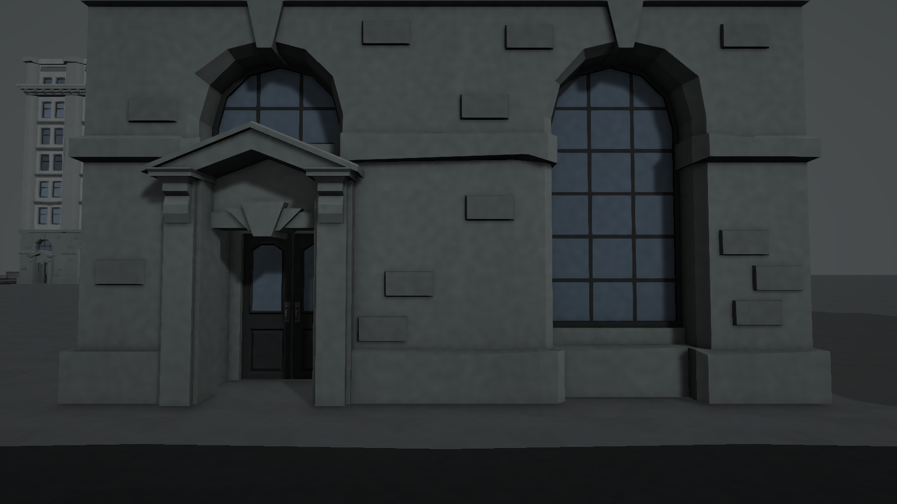
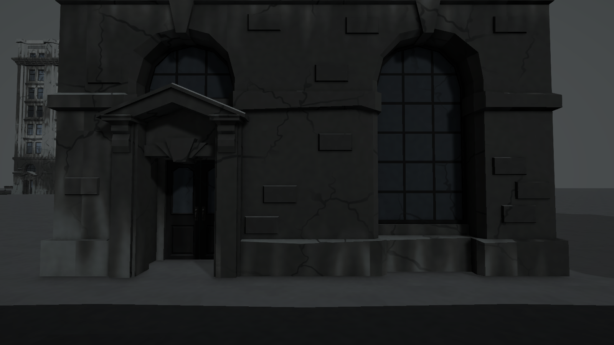
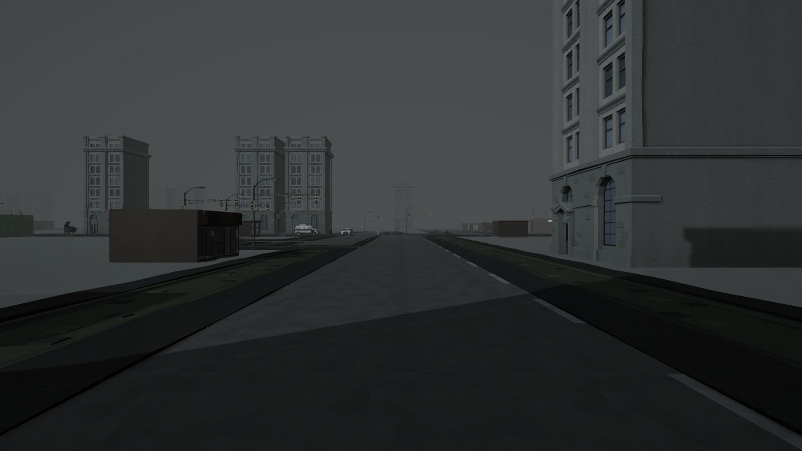
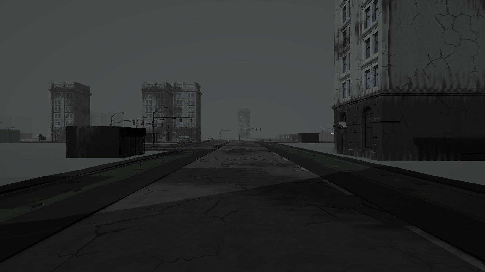
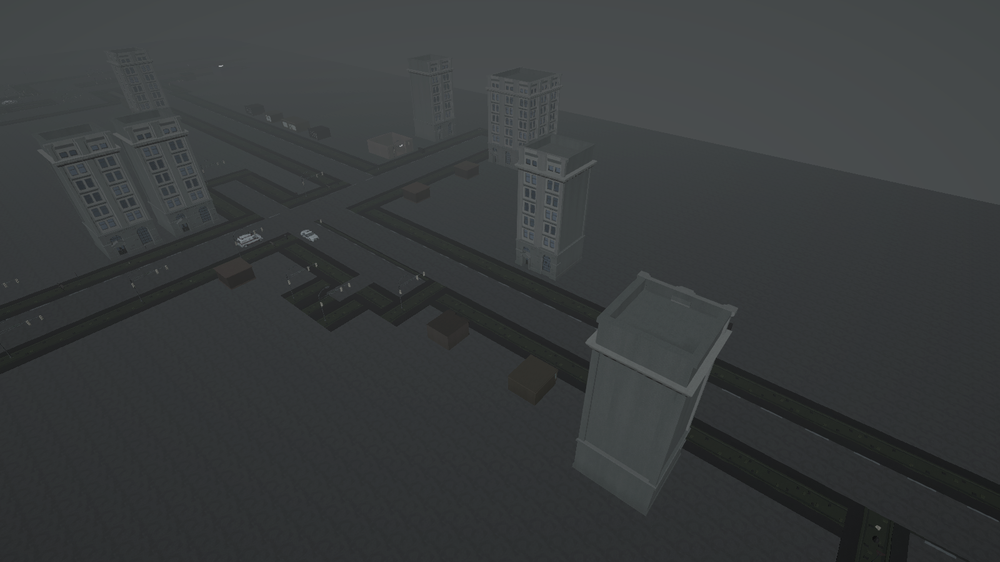
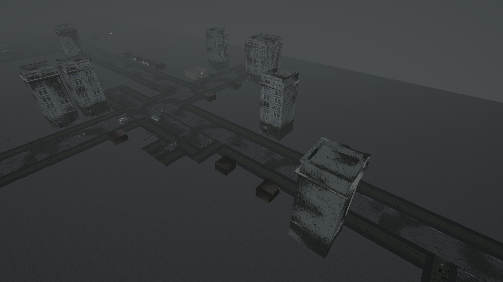

# 폐허 표면 비교

기존 HumanThings 표면을 기준으로 균열과 넓은 화재 그을음만 추가한 별도 버전이다. Synty 원본, 기존 비주얼 프로필/셰이더, 메시, 충돌, 배치, 조명, 안개, 캐릭터는 유지한다. 미션 장소와 베이스캠프는 추가 효과 대상에서 제외한다. 새 마스크는 월드 좌표 기반이므로 같은 맵에서 플레이어마다 동일하게 보인다.

## 선택 방법

- 일반 `Play-DeveloperSolo.cmd`: 폐허 표면 적용.
- `Play-OriginalSurfaces.cmd`: 같은 Latest 실행 파일을 기존 표면으로 실행. `--original-surfaces` 인자만 다르다.
- Unity Play Mode: `Tools > HumanThings > Visual > Ruins`에서 `Existing Surfaces` / `Ruined Surfaces`로 즉시 전환. 일반 Editor 비교 창으로 적용한 씬에서도 사용 가능.
- 영구 기본 선택: `Assets/HumanThings/Visual/Resources/HumanThingsRuinProfile.asset`의 `Enabled By Default`. 끄면 기존 표면이 기본이다. 실행 파일에는 재빌드 후 반영된다.

## 구현 및 보존

`HumanThingsRuinSurfaces`가 생성된 일반 도시 Chunk의 불투명 환경 재질만 복제한다. 미션 POI와 캠프는 별도 계층이므로 제외된다. 텍스트와 식생, 투명 재질도 제외한다. 콘크리트/도로에는 균열, 차량/금속에는 균열을 15%로 제한하고 그을음 위주로 표현한다. 도로의 그을음은 기본의 55%로 낮춰 경로 가독성을 보존한다. 실제 구멍, 파편, 새로운 콜라이더, 실시간 파괴는 없다.

기존 셰이더에서 분리한 `RuinedEnvironment.shader`에 절차적 불규칙 균열과 넓은 소손 마스크를 추가했다. 추가 텍스처 구매나 원본 재질 덮어쓰기는 없다. 프로필에는 강도와 크기가 분리되어 있다. 공유 복제 재질은 비교 전환이나 월드 종료 시 해제된다. 셰이더 비용은 증가하며 GPU 성능 정밀 측정은 아직 하지 않았다.

## 동일 시점 비교

StandardCity seed 100. 동일 카메라/조명/안개, 외부 이미지 보정 없음. 정지 캡처에만 FXAA를 사용하여 카메라 이동 시 TAA 잔상을 배제했다. 실제 게임의 기존 TAA 설정은 그대로다.

### 외벽 근거리: 기존

### 외벽 근거리: 폐허

### 도로: 기존

### 도로: 폐허

### 전체: 기존

### 전체: 폐허

벽의 기존 그림자와 창문 구조를 남기면서 소손 영역과 갈라짐을 추가했다. 다만 개별 창문에서 불이 번진 경로를 미술적으로 그린 것은 아니며 공통 절차적 표면 효과다. 메시가 그대로이므로 건물의 실제 실루엣 붕괴는 없다.

## 검증 결과

- 관련 EditMode 테스트 5개 통과: 프로필/셰이더, 원본 재질 복원, 대상 외 오브젝트 제외, POI/메시/콜라이더/환경 보존.
- 생성된 도시의 4개 시점 전후 캡처 성공. 각 적용에서 미션 장소 재질 참조 및 메시 참조 불변 검사 통과.
- Windows Latest 빌드 성공. 실제 호스트/클라이언트 실행에서 seed 100, 플레이어 2명, 시설 15개 로드 통과. 해당 로그에서 예외/셰이더 오류 없음. 테스트 프로세스 종료 확인.
- 실행 파일의 캠프 내부 카메라 캡처는 `Player` 폴더에 저장했다. 캠프는 그대로이고 외부 배경 건물에만 새 효과가 보인다. 이는 전체 임무 완료나 성능 벤치마크를 뜻하지 않는다.
